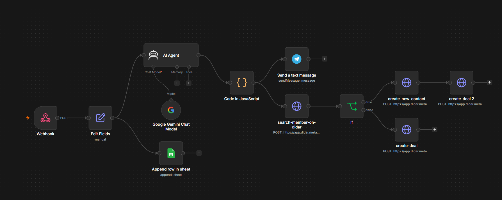

اتوماسیون هوشمند جذب لید و مدیریت مشتریان با CRM دیدار و n8n

این پروژه یک سناریوی عملیاتی برای خودکارسازی فرآیند دریافت و ارزیابی مشتریان احتمالی است که با n8n پیاده‌سازی کرده‌ام.

هدف اصلی این بوده که لیدهایی که از سمت فرم‌های سایت می‌رسند، بدون فوت وقت آنالیز شوند، وضعیت آن‌ها مشخص شود و سریعاً به تیم فروش و سیستم CRM منتقل شوند تا هیچ مشتری بالقوه‌ای از دست نرود.

این سناریو چه مشکلی را حل می‌کند؟

## Demo

در این ویدیو، نحوه کارکرد زنده سناریو، ارسال داده‌ها و ثبت خودکار در سیستم‌ها را مشاهده می‌کنید:

<video src="./demo.mp4" controls width="100%"></video>

تیم‌های فروش معمولاً زمان زیادی را صرف بررسی دستی فرم‌های ورودی، جداسازی درخواست‌های واقعی از غیرواقعی و ثبت اطلاعات در سیستم مدیریت مشتریان می‌کنند.

در این اتوماسیون، تمام مراحل زیر در چند ثانیه به صورت خودکار انجام می‌شود:

۱. دریافت داده‌ها: اطلاعات فرم سایت از طریق وب‌هوک دریافت می‌شود.
۲. ارزیابی و رتبه‌بندی: با کمک مدل Gemini، درخواست کاربر و بودجه پیشنهادی آنالیز شده و لید در یکی از دسته‌های عالی، متوسط یا ضعیف قرار می‌گیرد.
۳. پیشنهاد اقدام به فروشنده: سیستم بر اساس تحلیل انجام‌شده، به کارشناس فروش پیشنهاد می‌دهد که گام بعدی چه باشد.
۴. ذخیره‌سازی داده‌ها: یک نسخه از اطلاعات برای پیگیری‌های بعدی در گوگل شیت ذخیره می‌شود.
۵. اطلاع‌رسانی در تلگرام: پیام ساختاریافته همراه با تمام جزئیات و درجه اهمیت لید برای تیم فروش ارسال می‌شود.
۶. مدیریت در CRM دیدار: ابتدا شماره مشتری در سیستم جستجو می‌شود. اگر مشتری جدید باشد، مخاطب ایجاد شده و معامله جدید ثبت می‌شود. اگر مشتری از قبل وجود داشته باشد، معامله جدید مستقیماً به پرونده قبلی متصل می‌شود تا داده تکراری ایجاد نشود.

ابزارها و سرویس‌های استفاده‌شده

- n8n برای مدیریت و اجرای سناریو
- Google Gemini برای تحلیل متن درخواست و تعیین سطح لید
- Didar CRM برای جستجوی مخاطب، ثبت مخاطب جدید و ایجاد معامله
- Telegram Bot برای ارسال پیام‌های لحظه‌ای به تیم فروش
- Google Sheets برای ذخیره و بایگانی داده‌ها
- JavaScript برای تمیزکاری، اعتبارسنجی خروجی و مدیریت خطاهای احتمالی

پیش‌نمایش سناریو

در تصویر زیر می‌توانید ساختار کامل نودها و جریان داده‌ها را در محیط n8n ببینید:

نحوه استفاده و تست سناریو

اگر می‌خواهید این سناریو را روی n8n خودتان تست کنید:

۱. فایل crm-autojson موجود در همین مخزن را دانلود کنید.

۲. در محیط n8n از بخش ویرایشگر، فایل را وارد کنید.

۳. دسترسی‌های مربوط به کلیدهای API گوگل، گوگل شیت، ربات تلگرام و API دیدار را تنظیم کنید.

۴. شناسه مربوط به مرحله خط لوله در نودهای CRM دیدار را متناسب با پنل خودتان جایگزین کنید.

